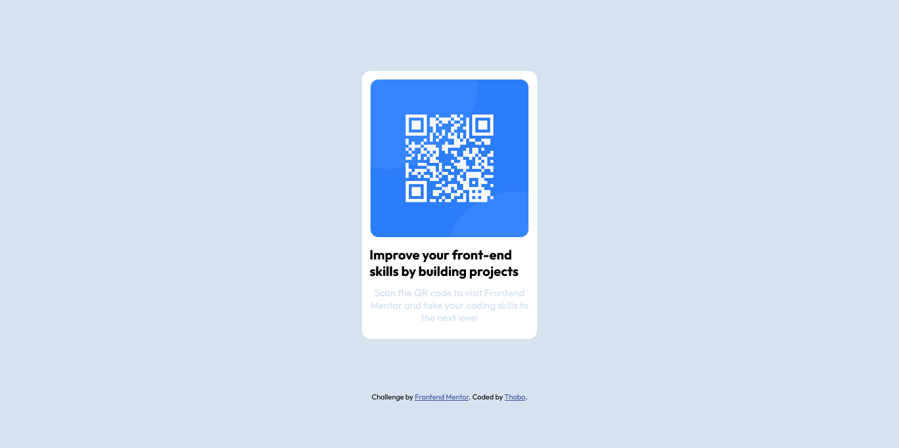
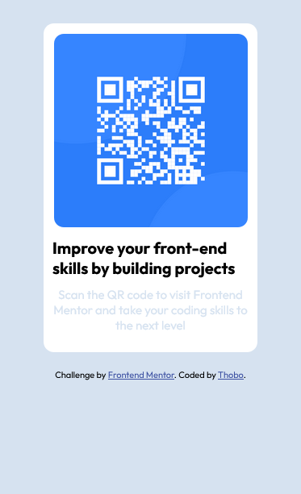

# Frontend Mentor - QR code component solution

This is a solution to the [QR code component challenge on Frontend Mentor](https://www.frontendmentor.io/challenges/qr-code-component-iux_sIO_H). Frontend Mentor challenges help you improve your coding skills by building realistic projects. 

## Table of contents

- [Overview](#overview)
  - [Screenshot](#screenshot)
  - [Links](#links)
- [My process](#my-process)
  - [Built with](#built-with)
  - [Continued development](#continued-development)
  - [Useful resources](#useful-resources)
- [Author](#author)

**Note: Delete this note and update the table of contents based on what sections you keep.**

## Overview

### Screenshot

#### Desktop design

#### Mobile design

### Links

- Solution URL: [qr-code-component-main](https://github.com/Thobo-Gaboipewe/qr-code-component-main)
- Live Site URL: [qr-code-component-main](https://https://qr-code-component-main-t.netlify.app/)

## My process

### Built with

- Semantic HTML5 markup
- Flexbox

### Continued development

I would like to focus more on web application development with Flask.

### Useful resources

- [Mozilla Developer Network](https://www.developer.mozilla.org)

## Author

- Frontend Mentor - [@Thobo-ops](https://www.frontendmentor.io/profile/Thobo-ops)